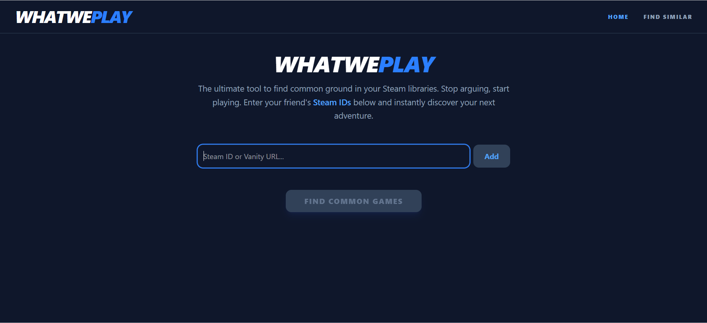
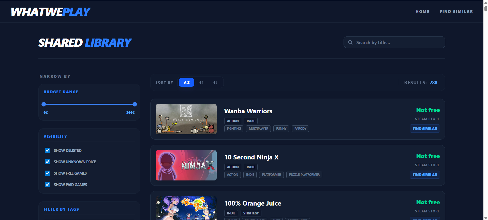

# WhatWePlay

A web application to find similar games based on Steam game data. Search for a game and discover recommendations based on tags, genres, player count, and review scores.

## Features

- **Game Search** - Search by game name or Steam AppID with autocomplete suggestions
- **Recommendations** - Find similar games based on tags, genres, pricing, and player reviews
- **Match Scoring** - Each recommendation includes a match score showing similarity (0-100)
- **Filtering** - Sort and filter games by genre, tags, and price range
- **Quick Navigation** - Find common games between Steam libraries

## Project Structure

```
whatweplay/
├── backend/
│   ├── main.py
│   ├── requirements.txt
│   └── operations/
│       ├── recommended_games.py
│       ├── game_intersection.py
│       └── get_game_info.py
│
└── frontend/
    ├── src/
    │   ├── pages/
    │   │   ├── Find-Similar.jsx
    │   │   ├── Recommended.jsx
    │   │   ├── Results.jsx
    │   │   └── Home.jsx
    │   └── components/
    └── package.json

```

## API Endpoints

- `GET /search-games/{query}` - Search for games (autocomplete)
- `GET /recommended-games/{game_id}` - Get recommendations for a game
- `GET /game-info/{game_id}` - Get game name from AppID
- `GET /common-games` - Find games in multiple Steam libraries

## Technologies Used

### Backend
- **FastAPI** - Modern Python web framework
- **Steam API** - Game data source

### Frontend
- **React** - UI framework
- **Vite** - Build tool and dev server
- **Tailwind CSS** - Styling

## Screenshots

### Home Page


### Shared Library
